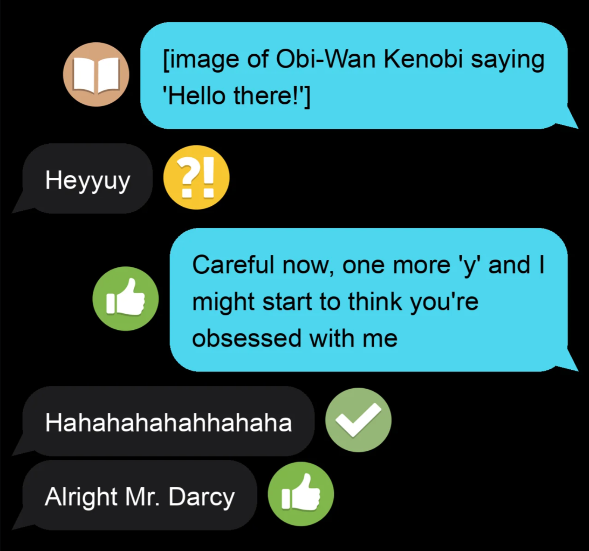
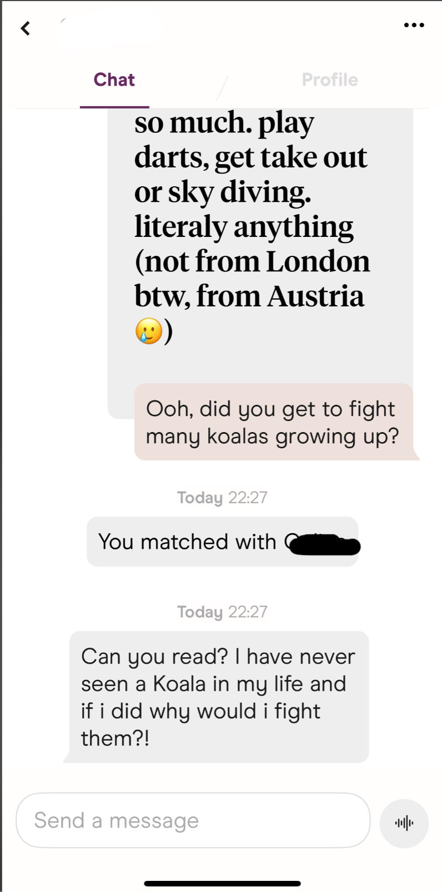
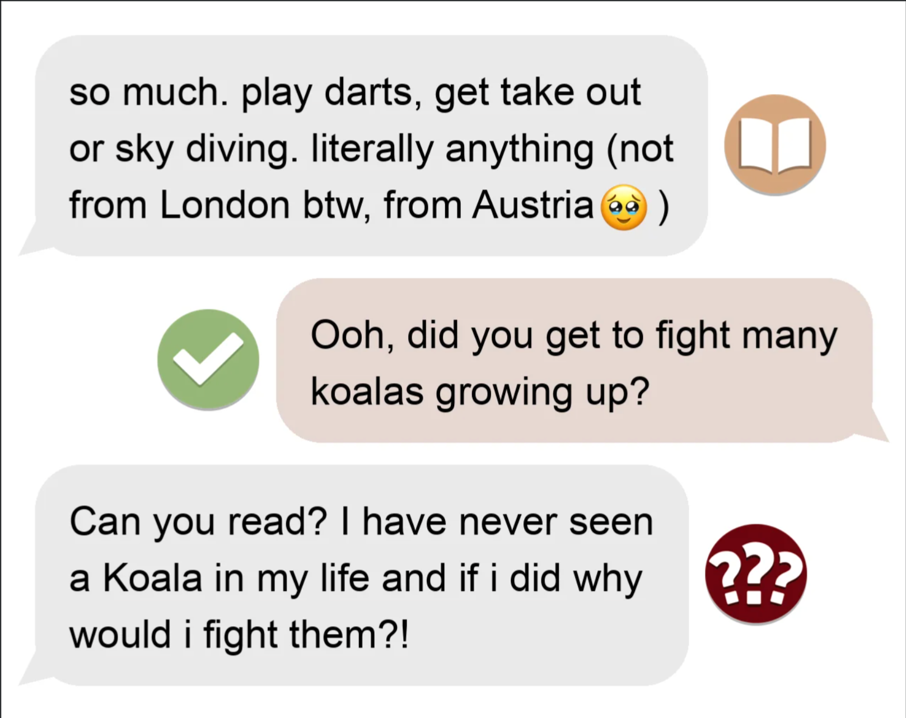
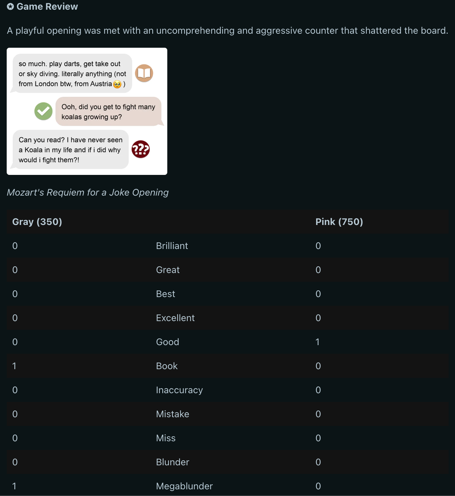

# TextingTheory Bot

> ⚠️ **Warning: This project analyzes and displays real text conversations, which may include NSFW (Not Safe For Work) or explicit content. Viewer discretion is advised.**

See it in action: [u/textingtheorybot on Reddit](https://www.reddit.com/user/textingtheorybot/)

---

TextingTheory Bot is a Devvit-powered Reddit app for r/TextingTheory that analyzes images of text conversations, generates a stylized review image, and posts a detailed "Game Review" comment. It leverages Google Gemini for AI analysis and a custom renderer for visuals.

## Features

- **Automatic Analysis:** Detects new image posts and analyzes the conversation using Google Gemini.
- **Stylized Image Generation:** Renders a unique, visually appealing image of the chat.
- **Game Review Comments:** Posts a rich comment with insights, stats, and the rendered image.
- **Custom Annotations:** Users can submit their own analysis if the bot's isn't quite right.
- **Elo Voting:** Community members can vote on the Elo rating for posts using `!elo` commands.

## How It Works

1. **New Post Detection:** The bot monitors r/TextingTheory for new image posts.
2. **AI Analysis:** Google Gemini analyzes the conversation for context, sides, and move quality.
3. **Image Rendering:** A Python script generates a stylized image of the conversation.
4. **Review Comment:** The bot posts a detailed comment with the image, stats, and insights.
5. **User Interaction:** Users can submit their own annotations or vote on Elo ratings.

## Examples

### Example 1: Rendered Annotation

_Above: A sample output image generated by the bot's renderer._

### Example 2: Full Flow

| Step                           | Screenshot                           |
| ------------------------------ | ------------------------------------ |
| a. Original Hinge conversation |     |
| b. Rendered image              |  |
| c. Bot's Reddit comment        |     |

---

### Changelog

- Game Rating (estimated Elo)
- Added ending classifications
- Replaced _Missed Win_ with _Miss_
- Emoji rendering
- Game summary table
- Dynamic render colors
- Render visible in comment (as opposed to Imgur link)
- Language translation
- Opening names
- ~~Best continuation~~ removed, not very good
- ~~!annotate command~~ (replaced with a Devvit menu option)
- Updated badge colors
- Added _Megablunder_ (Mondays)
- annotate Reddit comment chains (also three dot menu option)
- New/updated ending classifications
- Added _Interesting_
- ~~Eval bar~~ (removed, doesn't really fit as part of "Game Review")
- ~~Similar Games~~ (removed, possibly will bring back)
- Coach's commentary
- Devvit App - cleaner/faster workflow, stickied comments, Annotate menu option, etc.
- Added _Superbrilliant_ (Saturdays)
- Elo vote
